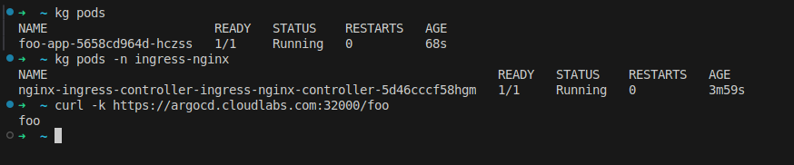
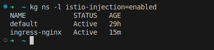
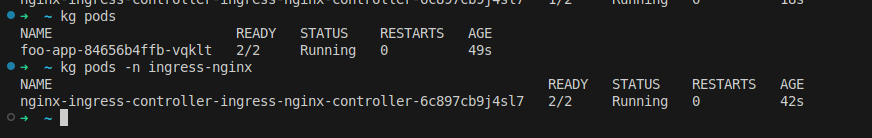
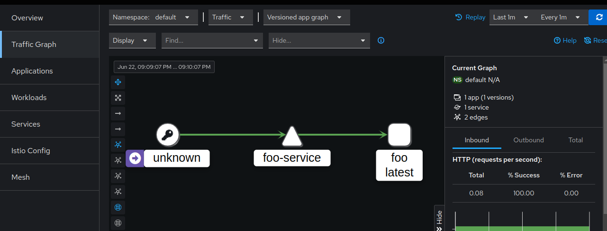
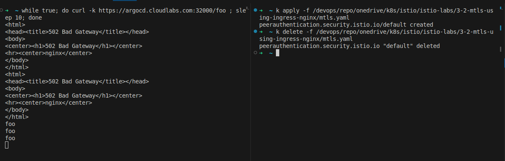
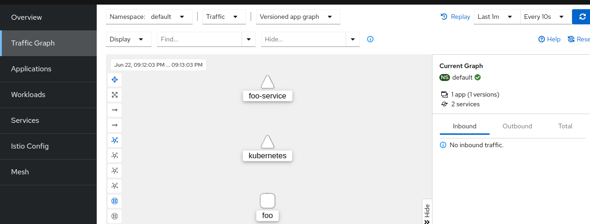
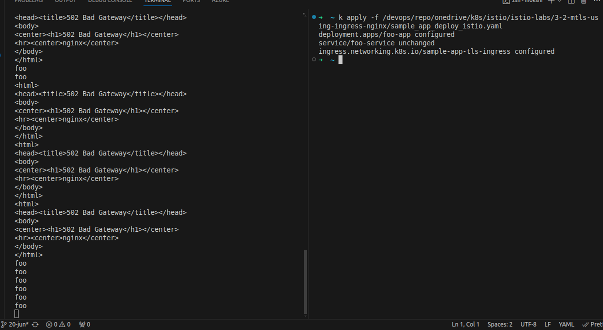
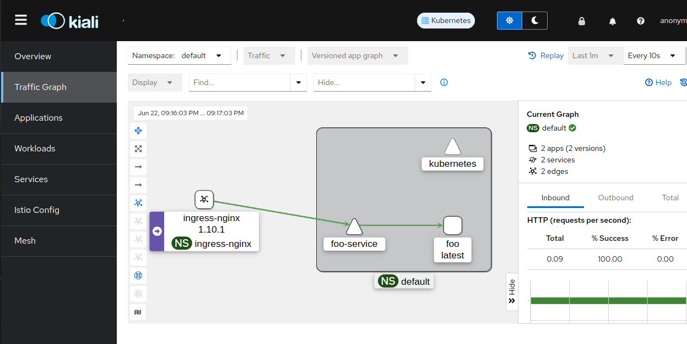

Enable the MTLS between ingress-nginx controller and application pods using Istio. 

Pre-Request:
1. Make sure you have working environment consists of 
    1. Ingress-nginx controller. 
    2. Application 
    3. Application is accessible via ingress 



2. Install Istio 

3. Set the istio-injection lable in default namespace and ingress-nginx namespace
```bash
kubectl label namespace default istio-injection=enabled
kubectl label namespace ingress-nginx istio-injection=enabled
```


4. Restart the pods in application and ingress-nginx namespace. 



5. Verify application 



6. Enable the Strict MTLS  
```yaml
apiVersion: security.istio.io/v1beta1
kind: PeerAuthentication
metadata:
  name: default
  namespace: default
spec:
  mtls:
    mode: STRICT

```
7. Application Fails immediatly. 



8. Add the annotations in the application ingress. 
```yaml
annotations:
    nginx.ingress.kubernetes.io/service-upstream: "true"
   nginx.ingress.kubernetes.io/upstream-vhost: foo-service.default.svc.cluster.local

```



